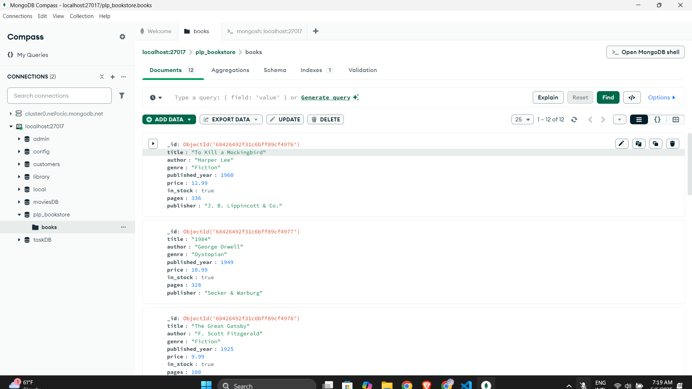

[](https://classroom.github.com/online_ide?assignment_repo_id=19704794&assignment_repo_type=AssignmentRepo)
# MongoDB Fundamentals Assignment – Completed by Linet

This project contains my completed work for the MongoDB Fundamentals Assignment. The goal was to practice MongoDB basics using Node.js, including setup, CRUD operations, advanced queries, aggregation pipelines, and indexing.

---

## ✅ My Setup

- **MongoDB Version:** Installed locally on `mongodb://localhost:27017`
- **MongoDB Shell:** `mongosh` used for interactive testing
- **Node.js Version:** v18+
- **Editor:** Visual Studio Code
- **Database Name:** `plp_bookstore`
- **Collection Name:** `books`

---

## ✅ Tasks Completed

### 1. Database Initialization

- Used the provided `insert_books.js` script to populate the `books` collection.

### 2. CRUD Operations in `queries.js`

- 🔍 **Find books by genre**
- 📅 **Find books published after a certain year**
- ✍️ **Find books by a specific author**
- 💰 **Update the price of a specific book**
- ❌ **Delete a book by title**

### 3. Advanced Queries

- ✅ **Filter:** Find in-stock books published after 2010
- ✅ **Projection:** Return only `title`, `author`, and `price`
- ✅ **Sorting:** By `price` ascending and descending
- ✅ **Pagination:** Using `.skip()` and `.limit()` (5 books per page)

### 4. Aggregation Pipelines

- 📊 **Average price by genre**
- 🏆 **Author with the most books**
- 🗂 **Group books by publication decade and count them**

### 5. Indexing and Optimization

- ✅ Created a **single index** on `title`
- ✅ Created a **compound index** on `author` and `published_year`
- 🔍 Used `.explain("executionStats")` to compare performance with indexes

---

## 📂 Files Included

- `insert_books.js` – Populates database
- `queries.js` – Contains all queries, CRUD operations, and aggregations
- `README.md` – This documentation
- 📸 Screenshot of database (please ensure to include this manually before submission)

---

## 🚀 How to Run

1. Run insert_books.js to create the database and collection. This will also insert books in the books collection.
```
node insert_books.js
```

2. Run the queries:

```
node queries.js
```

3. Run the aggregate functions:

```
node aggregates.js
```

4. Run the indexing:
```
node indexing.js
```

### MongoDB Compass 
